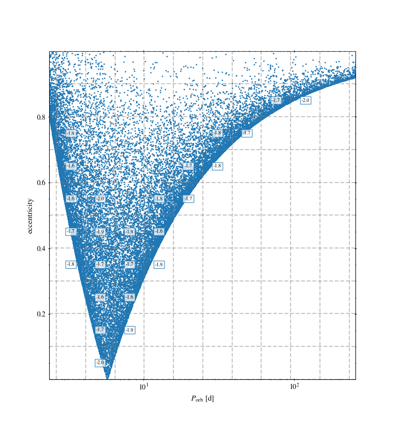

==========
Quickstart
==========

``poskiorb`` is a module that computes changes in the orbital parameters of a binary system after
a core-collapse event with an associated asymmetric kick imparted to the compact remnant.

Equations to compute these changes are derived from the conservation of linear momentum as
presented in `Kalogera, 1996 <https://ui.adsabs.harvard.edu/abs/1996ApJ...471..352K/abstract>`_.

Installation
------------

We provide a single ``Makefile`` that will allow you to install the code. In order to do that,
grab the latest version of the code from the RELEASE PAGE

Once downloaded, unzip it and, in a terminal, run

.. code-block::

    make install

Getting started
---------------

Here we provide a simple example on the usage of the ``poskiorb`` module.

To start using the module, you can import it into an interactive python shell, a script or a
jupyter notebook

.. code-block::

    import poskiorb

We'll compute orbital changes to a binary system consisting of a collapsing star of 12.81 solar
masses which produces an 8 solar mass black hole; its companion is a 7 solar mass star and the
orbital period is set to 5 days (before the core collapse):

.. code-block::

    binary = poskiorb.binary.BinarySystem(
      m1=12.81, m1_core_mass=9, m1_remnant_mass=8, m1_fallback_fraction=0.50,
      m2=7,
      P=5
    )

Next, we set the distribution of asymmetric natal-kicks. It will consist of 50000 kicks, with a
Maxwellian distribution in strength, isotropically-orientated, with a scaling to the strength based
on the amount of material that falls back to the compact remnant (``m1_fallback_fraction``):

.. code-block::

    binary.set_natal_kick_distribution(
      n_trials=50000,
      distribution_id='Maxwell',
      kick_scaling=lambda x: (1-binary.m1_fallback_fraction)*x
    )

    binary.get_natal_kick_distribution()

After having computed all the kicks, calculate post-kick orbital configurations (only those which
remain bound):

.. code-block::

    binary.get_orbital_distribution(verbose=True)

Once the orbital parameters are known, divide the parameter space of separation (or orbital period)
and eccentricity according to the probability of finding binaries in different 2D bins:

.. code-block::

    binary.get_post_kick_grid(use_unbounded_for_norm=True, verbose=True)

We can show this grid in a figure!

.. code-block::

    binary.show_post_kick_with_grid(xattr='P', yattr='e', s=1)

And even save this grid to a file

.. code-block::

    binary.save_target_grid(fname='grid.data')

.. note::

   The output of this grid file will contain a header with information on the binary system and the
   distribution of kicks. Also, for each point in the grid, the probability of finding a binary
   there will be saved. It will look something like this:

   .. code-block::

      # Target grid of orbital parameters
      # Binary at core-collapse
      #          m1 [Msun]          m2 [Msun]           P [days]           a [Rsun]     m1_core [Msun]              m1_fb  m1_remnant [Msun]
      #       1.281000E+01       7.000000E+00       5.000000E+00       3.328600E+01       9.000000E+00       5.000000E-01       8.000000E+00
      # Asymmetric natal kick parameters
      #       distribution              sigma              min_w              max_w           N_trials           min_prob
      #            Maxwell       2.650000E+02       0.000000E+00       1.000000E+99              50000       1.000000E-02

         natal kick id      period [days]  separation [Rsun]       eccentricity        probability
                    00       5.120560E+00       3.082446E+01       5.169521E-02       1.048000E-02
                    01       5.120560E+00       3.082446E+01       1.515052E-01       2.060000E-02

